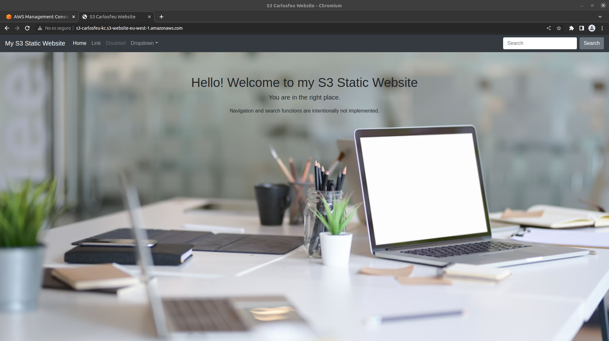
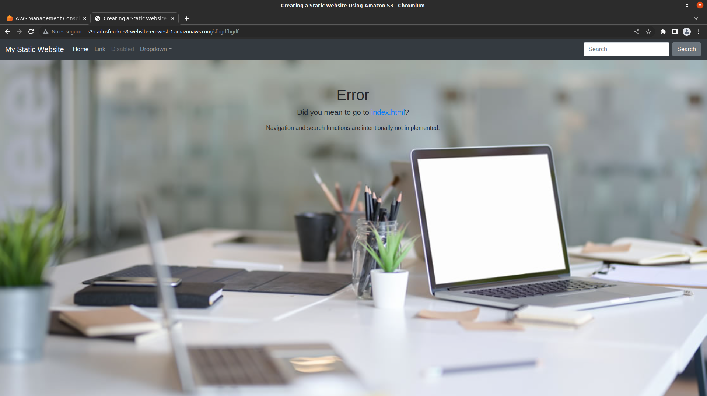
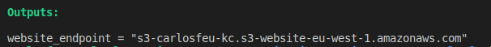

# Practica final AWS-carlosfeu

- La práctica consiste en un despliegue de S3 con un hosting web estáctico, el cual nos muestra nuestra página y en caso de meter una dirección diferente a la que nos da el hosting web, nos saldra un mensaje de error.

- El primer paso que debemos realizar es la clonación del repositorio de github que es el siguiente:

  https://github.com/KeepCodingCloudDevops6/aws-carlosfeu.git

## Requisitos 

- Los requisitos son tener una cuenta de AWS
- Tener instalado Terraform

## Contenido

- Dentro del respositorio encontraremos una estructura de carpetas y de archivos:
    - Tenemos una carpeta llamada "files" donde encontraremos el código html utilizado en el index y el error

    index.html

    

    error.html

    

    - En otra de las carpetas llamada "images" encontramos una imagen utilizada en la creación de la web estática y las del README.
    - Acabando con las carpetas, la de "policy" que en su interior tenemos la política del S3.
    - El .gitignore con lo que no queramos que se suba al repo
    - El propio README con la documentación del deploy.
    - por último, encontramos los archivos de configuración de terraform que se dividen en:
        - El "providers.tf" que todo despliegue de terraform tiene que tener.
        - El "main.tf" donde vemos todos los recursos aplicados en la práctica.
        - El "outputs.tf" con lo que queramos que muestre en pantalla al hacer el deploy, en este caso el website_endpoint, que será la dirección que introduciremos en el navegador.
        
        - El "variables.tf" con una variable de la región del providers.
        
## Para desplegar

- Teniendo clonado el repositorio de github, accedemos al directorio "aws-carlosfeu" y desde el terminal realizamos primero el comando de
```bash
terraform init
```
- Una vez lo lancemos estamos listos para lanzar el apply que es el siguiente:. Nos dirá si estamos seguro de lo que vamos a desplegar y si así es, escribimos "yes" e intro. A veces cuando lanzamos el apply nos da algún que otro error, esto es debido a que se intentan crear los objetos antes de que esté creado el bucket y debido a eso fallan, pero el bucket si se crea. Entonces a la segunda vez que lanzamos el apply con el bucket ya creado, los objetos se crean sin problemas, es decir, hay que lanzarlo 2 veces. Veremos como se soluciona sin problemas.
```bash
terraform apply
```
- Una vez esté levantado podremos acceder a la dirección que nos da el "outputs" y veremos la pagina web estática. Para ver el error añadiremos al final de la url separado con "/" cualquier palabra o dirección.


## Para finalizar

- Una vez hayamos realizado los pasos anteriores lo que tenemos que hacer es eliminar el deploy, eso se hace a través del siguiente comando:

```bash
terraform destroy
```
- Una vez lanzado, nos dirá que es lo que se va a borrar y si estamos seguros. Si lo estamos, escribimos "yes" y luegos presionamos intro. Al igual que con el apply deberemos hacer 2 veces el "destroy" en caso de que nos falle, puede dar el fallo de que el bucket no está vacío y por eso no se puede borrar pero a la segunda que ejecutemos el destroy, lo hará sin problemas.


